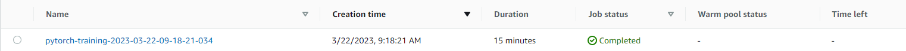
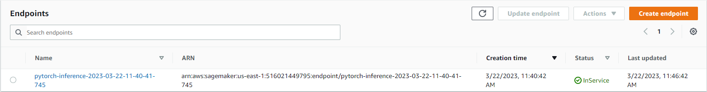

# Image Classification using AWS SageMaker

Use AWS Sagemaker to train a pretrained model that can perform image classification by using the Sagemaker profiling, debugger, hyperparameter tuning and other good ML engineering practices. This can be done on either the provided dog breed classication data set or one of your choice.

## Project Set Up and Installation
Enter AWS through the gateway in the course and open SageMaker Studio. 
Download the starter files.
Download/Make the dataset available. 

## Dataset
The provided dataset is the dogbreed classification dataset which can be found in the classroom.
The project is designed to be dataset independent so if there is a dataset that is more interesting or relevant to your work, you are welcome to use it to complete the project.

### Access
Upload the data to an S3 bucket through the AWS Gateway so that SageMaker has access to the data. 

## Hyperparameter Tuning
I used the resnet18 as my pretrained model.
Hyperparameter Tuning was done on the following hyperparameters:
- Learning rate - ranging from 0.001 to 0.1
- Batch sizes - (32, 64, 128, 256, 512)

## Screenshot of Completed Training Job
 

## Debugging and Profiling
### Profiling Steps:
1. Created Profiler Rules and Configs
2. Pass the Profiler Configuration to the estimator
3. Configure the hook in the training script

### Debugging Steps:
1. Import smdebug.pytorch as smd
2. In the train() fuunction, add the SMDebug hook for pytorch with TRAIN mode
3. In the test() function, add the SMDebug hook for pytorch with EVAL mode
4. In the main() function, creat the SMDebug hook and register the model and loss function
5. In the main() function, pass the SMDebug hook to the train() and test() functions in the epoch loop.
6. Configured Debugger rules and Hook parameter


### Results
The training loss and the validation loss converges at the fifth epoch

## Model Deployment
 - Deploy the model by running the code
 ```python
 predictor = estimator.deploy(initial_instance_count=1, instance_type="ml.t2.medium")
 ```
 - Import create_data_loaders from train_model.py to create an image loader
 ```python
 from train_model import create_data_loaders
 ```
 ```python
 test_loader = create_data_loaders("./dogImages/test/", 1)
 ```
 - Make a prediction by running the following code
 ```python
 response = predictor.predict(image)
 ```

## Screenshot of Deployed Model


## Standout Suggestions
**TODO (Optional):** This is where you can provide information about any standout suggestions that you have attempted.
